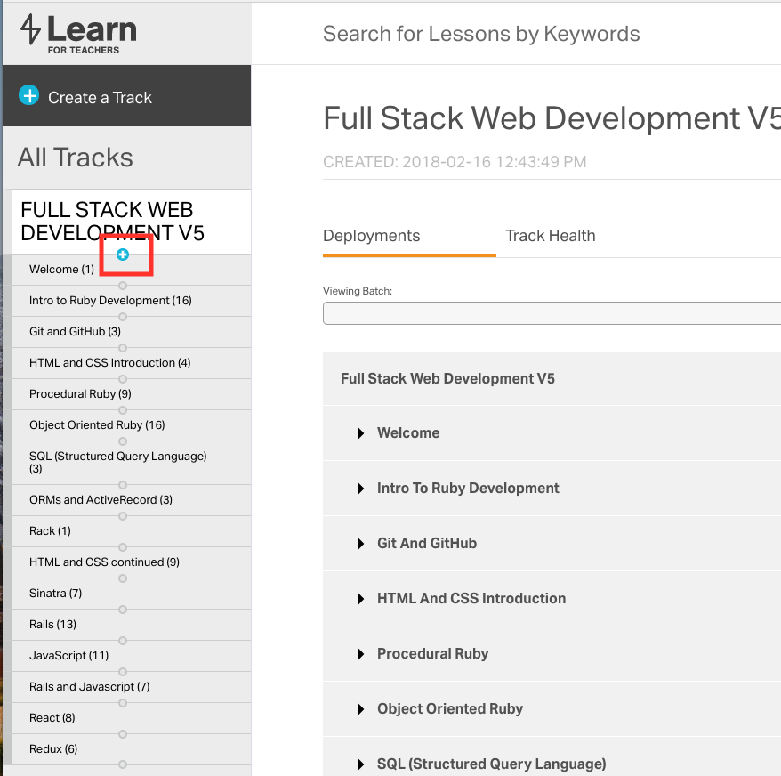

# How Do I Create / Populate a New Track?

1. Visit learn.co/curriculum
2. (+) Create track
3. Enter Title. Pro-tip from Jason Decker: copy and paste from the old version
   so that you don't make an error. Typically the entry would be of the form
   $PRODUCT-v1 to $PRODUCT-v2
4. Select the newly created track
5. Under the track name, hit the "circle." As you hover it will become a plus.
   Click the plus. 
6. You can now choose to create a topic or find a topic. Since, for the most
   part, you're going to keep 90%+ of what was pre-existing you're going to
   want to copy nearly 100% and pare down what doesn't need to exist any longer
   ("deleting"). 

