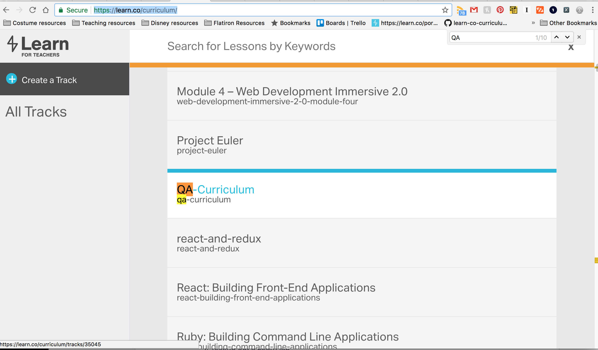
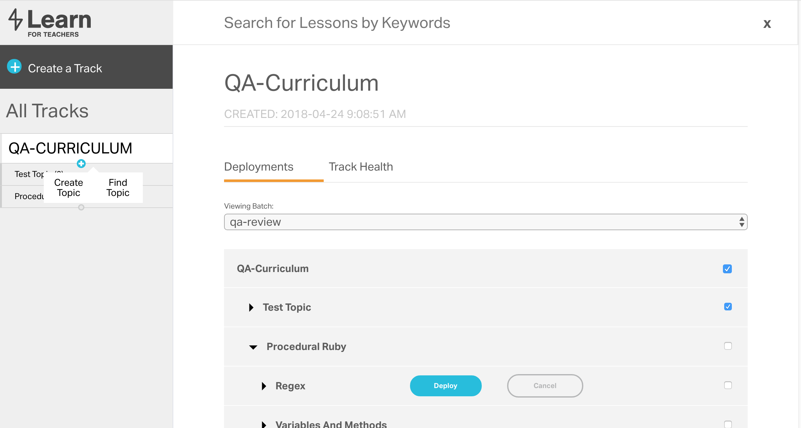
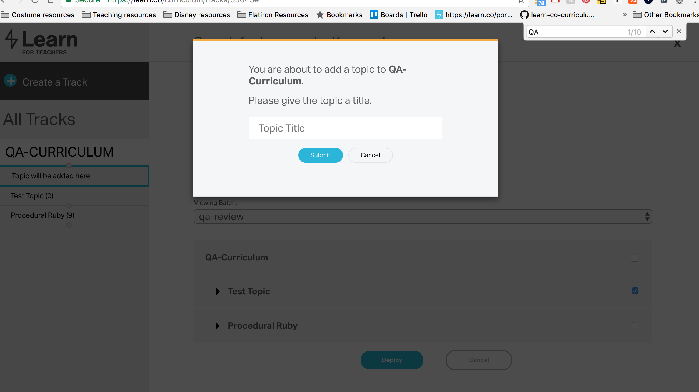
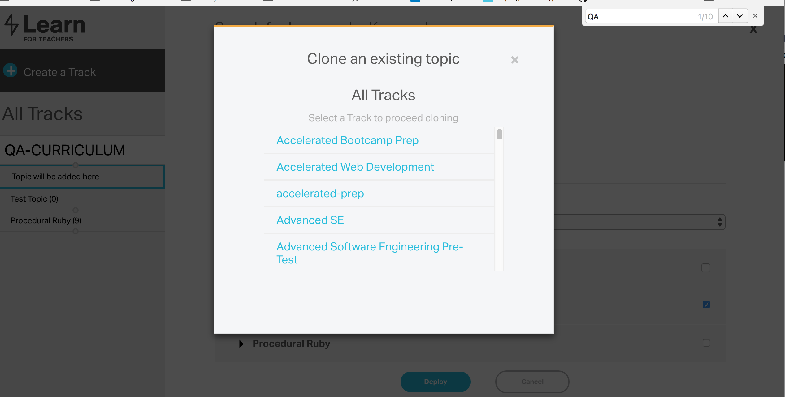
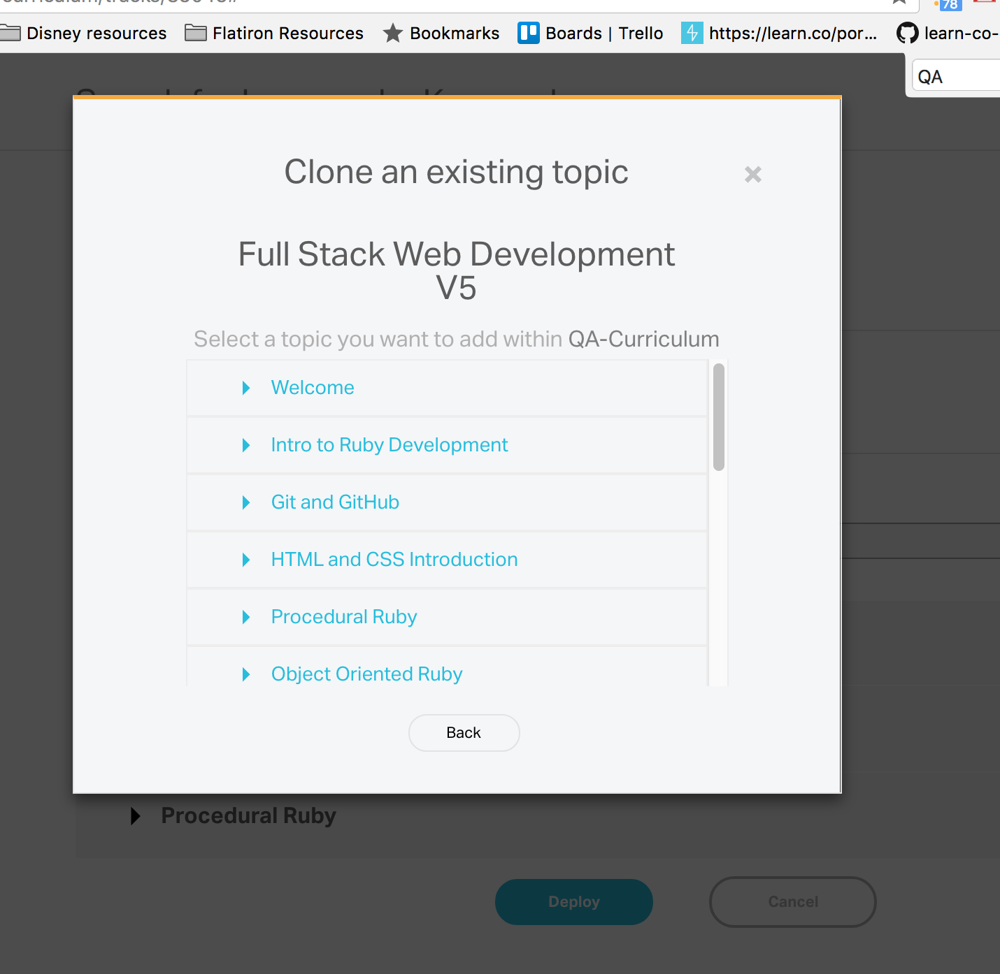
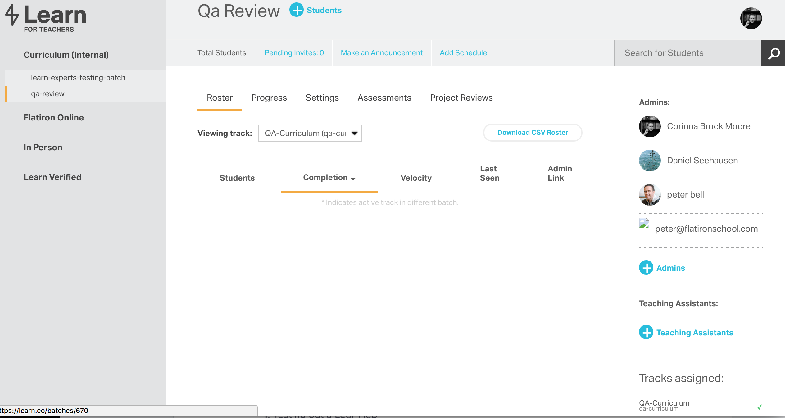
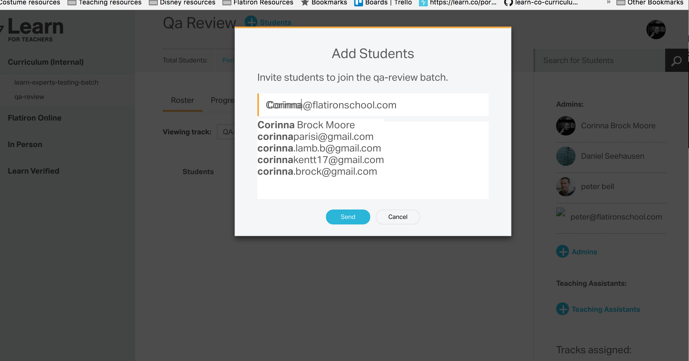

This document assumes that you have followed the suggested process flow and are at the point where you are ready to have your work reviewed, either internally or externally. If you are just starting work, make sure you have read [why we always work in WIP](./why-we-work-in-wip.md), [major project deploy](./major_project_deploy_new_version.md), [git flow](./repo-git-flow), and the Flatiron School [style guide](./style_guide). The full process for releasing can be found in [updating lessons process](./updating-lessons-process.md).

## QA Process: major changes with outside reviewers, viewing the changes within the Learn.co platform
1. If not already added/created, add or create the topic to QA-Curriculum track
  - Visit the [Learn.co curriculum](https://learn.co/curriculum/) page
  - Locate and click on the QA-Curriculum track
    
  - Mouse over the grey dot on the left sidebar (SS). It will turn into a blue plus sign.
    
  - Click on the plus sign.
  - Choose either Create Topic or Find Topic.
    - If creating a topic, give your topic a name.
        
    - If finding a topic, first pick the track from which you'd like to clone the topic.
      
    - Next, select the topic you'd like to clone. You may re-name the topic if necessary.
          
2. If not already added, add the reviewer to the Qa Review batch.
  - Visit [https://learn.co/batches/](https://learn.co/batches/).
  - Select the qa-review batch under Curriculum (Internal) on the left sidebar.
    
  - Add the reviewer under the appropriate category. For most non-technical reviewers, this will be as a student. This is a judgement call on your part, depending on how much access the reviewer should have.
    
    - To add a reviewer as a student, click the blue + Students link at the top of the page.
    - To add a reviewer as an admin or teaching assistant, click on the blue + link in the right sidebar.
    - Use the box to search for the reviewer's name or email address. If the reviewer is a Flatiron School employee, clicking on their name should bring up the correct email address for them.
        
3. Publish updated lessons to the QA-curriculum track.
4. Email reviewers to inform them that they have new content to review.
