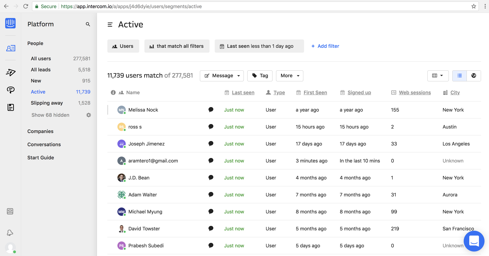
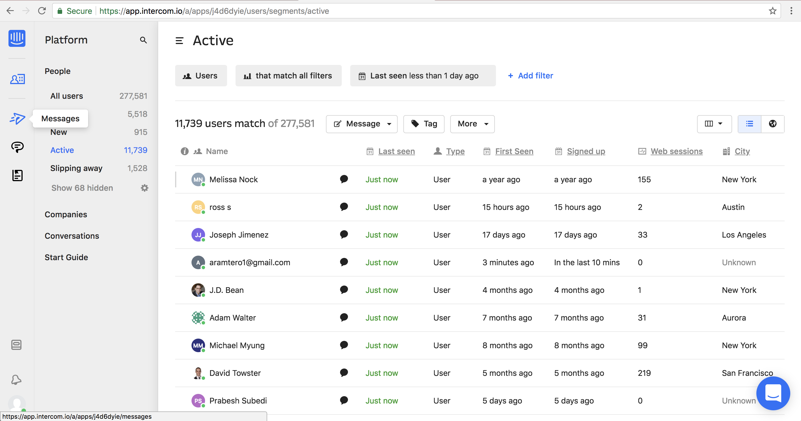
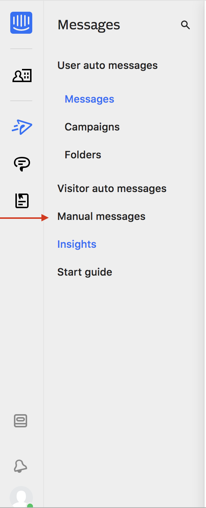
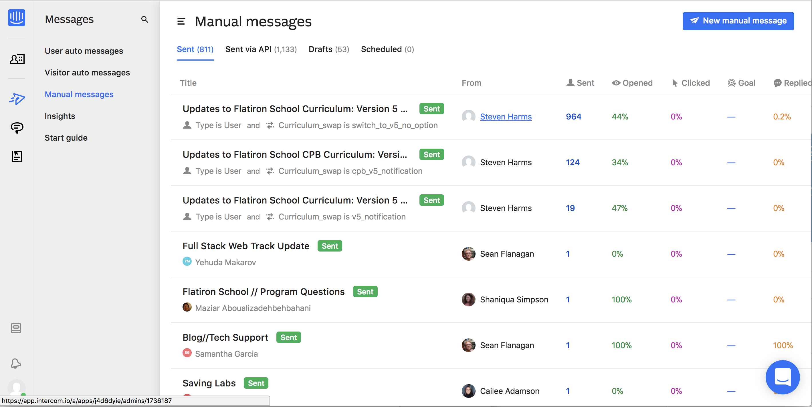
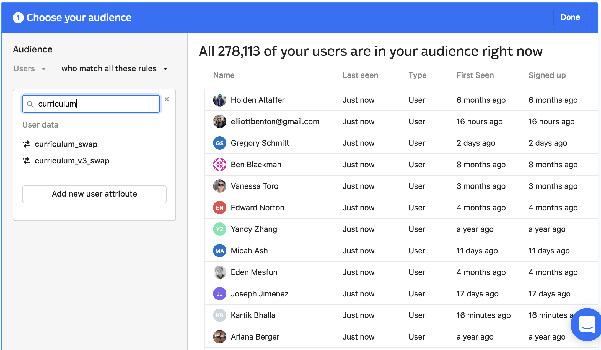
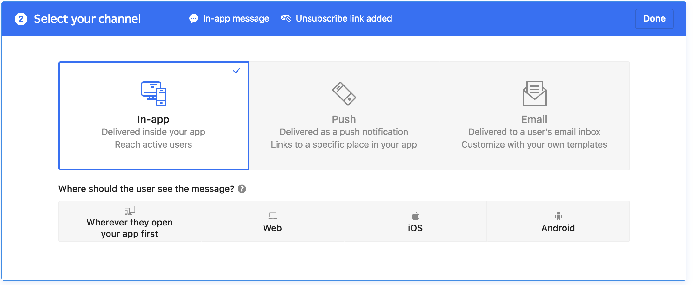

# Sending Mass Communications With Intercom

## Introduction

If you need to send mass email updates to our students (typically of the
"curriculum has changed" variety), here's how.

## Log into Intercom

## Select the Messages Button

## Select Your Type Of Message

For ad hoc messages you probably want "Manual Message." The others are desgined
for more automated use pathways.

## See If You Can Repurpose Content

Why reinvent the wheel, right? :)

## Filter the Population (If Necessary)

Curriculum + Product collaborations generally use the `curriculum_swap` key to
identify populations that require specific messages. You can select the user
population

## Decide the Appropriate Media

For email you will want email

## Continue

Past this the UI is pretty clear. Once you're done editing your message you
will be able to send test messages and review things. Once you're happy, ship
it!

