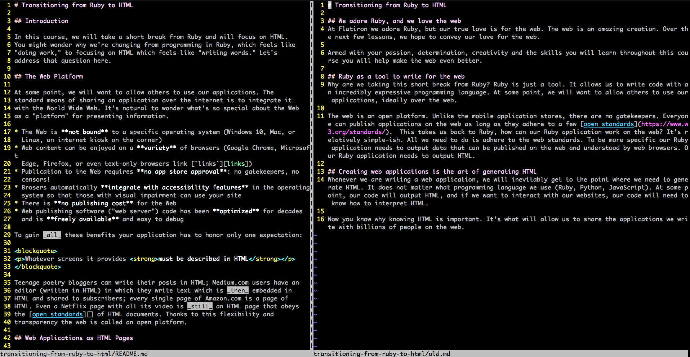
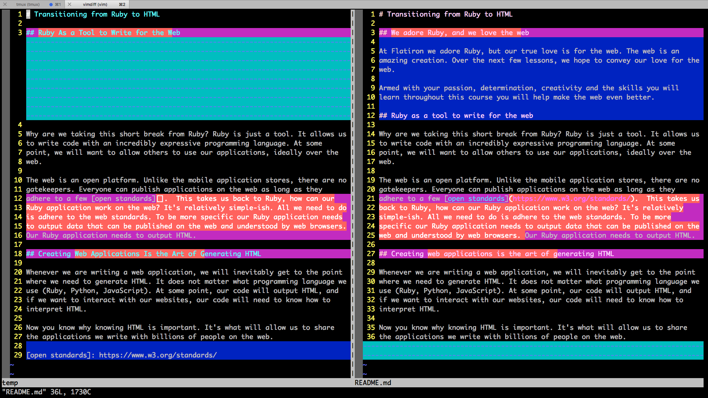

# Style Guide

## Introduction

To ensure that we all write with a common voice, we have adopted the following
style decisions.

Contents:

* Formatting Markdown
  * [Text Wrap at 80 Column](#text_wrap_at_80_column)
  * [Headings Get an Additional Blank Line](#headings_get_an_additional_blank_line)
  * [Do Not Leave Hanging Whitespace at End-of-Line](#do_not_leave_hanging_whitespace_at_end-of-line)
  * [Footnote Style Markdown Links](#footnote_style_markdown_links)
  * [Do Not Use Smartquotes](#do_not_use_smartquotes)
  * [Long Dash](#long_dash_em-dash_literal)
  * [Code Blocks](#code_blocks)
  * [Block Quote](#block_quote)
  * [Lists](#lists)
* Style
  * [Tone](#tone)
  * [Personhood](#personhood)
  * [Non-Gendered Speech](#non-gendered_speech)
  * [Abbreviations](#abbreviations)
  * [Code Words](#code_words)
  * [Capitalization](#capitalization)
  * [Asides](#asides)
  * [Numerology](#numerology)
  * [Latin Abbreviations](#latin_abbrevs)
  * [In-Line Quote](#in_line_quote)
  * [Disambiguation of "learn"](#disambiguation_of_learn)
  * [Learner vs. learner](#learner_vs_learner)
  * [Tables](#tables)
  * [Headings Should Be Capitalized According to AP Style](#headings_should_be_capitalized_according_to_ap_style)
* Engaging Writing
  * [Avoid Burying the Lede](#avoid_burying_the_lede)
  * [Avoid Value Judgements](#avoid_value_judgements)
  * [Prefer Active Voice](#prefer_active_voice)
  * [Write from the Student Perspective](#write_from_the_student_perspective)
  * [Avoid Rhetorical Questions to Drive Material](#avoid_rhetorical_questions_to_drive_material)

---

## Formatting Markdown

Use [GitHub-flavored markdown][GHMD].

<a name="text_wrap_at_80_column"></a>

## Text Wrap at 80 Column

Text should be hard wrapped near 80 column width. Here is the rationale.

The text we write as curriculum is not _merely_ text, it's _technical text_.
It's important to be written easily, but it's more important that it be
_reviewed, vetted, and dsicussed_ with the same rigor as code. We will, likely,
even review with a finer granularity than code. While, for instance, Ruby's
usages are likely to be on the expression level e.g. `derps.map{ |d| d + 2 }`,
in _technical text_ we are likely to analyze down to the _singular word_.

For this reason our style is influence by our text being _essentially_ code
that will be reviewed and discussed closely.

We should hard-break lines at 80 columns because...

### ...It Honors the Truth of Programming that Small Comparisons are easier

Smaller surface areas have proven again and again to be desirable. Single
Responsibility Classes, pure functions, mixins over inheritance chains. By
having code comparison being in shorter versus longer lines I can use tools
like `vimdiff` to "take" line 1 and 3, but leave 2. It makes editing easier.

### ...It Conforms to Multiple Code Standards

At the risk of an argument by appeal to authority, we'll acknowledge that the
most important open source project ever enforces an 80 column wrap.

* [Linux Kernel Guide][kernel-style]
* [Gitlab Style Guide][gitlab-sg]

### ... It is Easier to Point To Specific Granules of Usage

Per the [Gitlab][gitlab-sg] post:

> However, when you don't wrap [a line], a collaborator needs to point to the
> portion of the text before explaining the change, which can be very time
> consuming.

As an editor, all these will add up to a significant burn of editors' time.

### ...It Works on Smaller Screens

While at home, away, or on an iPhone one can compare code easily with two
vertical areas of 80 column width. Doing the same with long lines requires long
horizontal scrolls.

### ...It Works with Editing Power Tools

Here we'll demonstrate with `vimdiff`.



_Side-by-side editing_: Here it's harder to see that Right-side, line 9, fourth
sentence was the "thrust" of that paragraph and was promoted to Left-side, line
12. It's even a mouthful to refer to here.



_Side-by-side editing with column wrap_

Which will help you quickly understand the difference between two bodies of
_technical text_? Which one allows you to most flexibly pick and choose which
`diff` hunks you want? Which one would be easier to use to discuss granular
choices with a peer? A peer working on Skype on a laptop with precious little
screen real estate?

* Side-by-side editing is greatly abetted by able to have two vertical areas
  fit nicely
* Stacked (window on top of window)  involves a bigger eye-jump downward into a
  long line that can't be addressed by line number. For this reason few editors
  use this layout
* Data power tools like `diff`, `git`, `git diff`, `git * --patch`,  and
  `vimdiff` all excel when there are shorter lines.
* The portability of a given line is easier to repurpose:
  `grep derp README.md > derp_mentions`.
  With shorter lines you get less junk per grepped line.

### ...It is Supported by Most Editors and Costs Little Time to Follow

* [Atom][atom-hard-wrap]
* [Further...][80col]

For the reasons above we recommend an 80-column wrap. That said, don't make
changing this a holy war.

* **DO NOT** retroactively open a number of files and apply some sort of
  scripting to change this.
* **DO** try to create new files in line with this directive
* **IF**  you open a file to do significant work and its lines are wrapped, do
  a commit which does a wholesale reformat and then get to work.  The `diff`
  for this commit will (likely) touch many of the files and, as a result, if it's
  integrated with an actual content change, will make it difficult to see the
  content change in a sea of
  reformatted lines.

<a name="code_words"></a>

#### Code Words

When discussing a "code word" as part of a regular sentence, wrap the code word
in single back ticks ( \` ). This could be a variable name (`myString`), a
class name (`NSArray`), a method name (`.include?`), an operator (`<=>`), or a
string literal (`"Hi, Grandma."`); in general, any piece of code that does not
constitute a whole line or statement.

Avoid beginning a new paragraph with a code word:

Not: `pwd` means "print working directory".  
Use: The `pwd` command means "print working directory".  

Also avoid beginning a new sentence with a code word whenever possible, though
a semicolon `;` can be employed if altering the english syntax would make the
paragraph awkward.

<a name="capitalization"></a>

### Capitalization

Names of languages should be capitalized unless part of a code snippet (e.g.
Ruby or `ruby`, Objective-C, Python or `python`; not: ruby, objective-c,
python).  

Don't capitalize:

* autolayout (iOS)
* bash — the commonly-used acronym for Bourne-Again SHell.
* boolean — though in specific reference to the fields of Boolean Algebra or
* Boolean Logic this can be appropriate, just be consistent.
* debug console (iOS) — this is a colloquial name for the 'Console Output
* Viewer' in Xcode

**Do** capitalize:

* *most acronyms:* CLI, URL, HTTP, LLDB.
* *names of programming languages:* Python, Ruby, Objective-C, Swift, JavaScript
* Interface Builder — Xcode's integrated storyboard design tool.

<a name="asides"></a>

### Asides

Use sparingly

**Note:** *The basic aside for "whispering" something minor that doesn't fit
into the flow of exposition.*  
**Advanced:** *A helpful note that is not readily understandable to the present
skill level of the reading and not required to fulfill the objectives.*  
**Pro-tip:** *A note about style or best-practice, or a friendly reminder about
avoiding a common or simple mistake. Think opinion-piece.*  
**Hint:** (in labs) *A note about avoiding a common mistake not readily
apparent in the given instructions, or direction to a useful method that has
not been previously explained.* 
**Reminder:** *A reminder of previously learned concepts as we start to build
on them.* 

<a name="lists"></a>

### Lists:

1. Lists can be automatically numbered,
   * and contain bullet points.

* Or they can be unnumbered (bulleted) lists.

2 — You can also manually number your list if the automatic numbering gets
broken because of a code-snippet.

But, keep a consistent style. And generally avoiding making a list with only
one point. Consider using an aside.

If you reference other bullets use numbered list.

<a name="numerology"></a>

### Numerology

When discussing numbers in exposition paragraphs, remember the English rule
that numbers from zero to ten should be written out and values over 1,000
should be written with comma separators. Since this can collide with discussing
code, think of the use case to determine what you're talking about. Are you:

* discussing the number only in your exposition? Use the English form. 
* discussing an integer value from your code? Put the digit `10` in a code
  snippet. 
* discussing an abstract count that's relevant to your code? Do both, by
* presenting it as ten (10) or ten (`10`).

<a name="latin_abbrevs"></a>

### *exampla gratia* (e.g.) vs. *id est* (i.e.) vs. *et cetera* (etc.)

* e.g. — Latin for "given example(s)" — points to a single example or a finite
  list of examples.
* i.e. — Latin for "meaning" — points out a further explanation of the same
  idea.
* etc. — follows one or several examples pulled from a longer set of potential
  examples. 

*etc. and e.g. should not be combined in the same list*

<a name="headings_get_an_additional_blank_line"></a>

## Headings Get an Additional Blank Line

Markdown was designed to emualte rich text within console based editors and
pagers. As such a headline should "pop" by being surrounded by blank lines.

Do:

```
lorem ipsum sit dolor amet

## Example

Example is a very important word.
```

Do not:

```
lorem ipsum sit dolor amet

## Example
Example is a very important word.
```

Furthermore, many editors use newline to break when doing an automatic reformat
to 80-columns. Here's an example of how this looks when it goes wrong:


<a name="do_not_leave_hanging_whitespace_at_end-of-line"></a>

### Do Not Leave Hanging Whitespace at End-of-Line

When editing it's common to leave hanging whitespace

```
I hope that this 
does not reflect poorly on my yearly 
review.
```

If you try to "select" with your mouse, you'll see there are extra space
characters at the end of the first two lines.  Don't leave these. Most editors
will detect and highlight these.


<a name="footnote_style_markdown_links"></a>

## Footnote Style Markdown Links

Prefer footnote-style link definition to inline. Given our width constraint
guidelines, footnote-style helps keep the document readable. Further, as URLs
need to change, the grep-ability / maintainability is increased by using
footnote style. Prefer:

```

[Byron][] the poodle is a great dog.
[Karbit's Byron by the Bay][Byron] was born in Reno, NV but now dwells in Manhattan.

[Byron]: https://laurennicoleroth.smugmug.com/Byron/i-KgvCcgX/A

```

Not:

```
[Byron](https://laurennicoleroth.smugmug.com/Byron/i-KgvCcgX/A) loves to play in Marin County!
```

In the first sample we can use the `Byron` pointer in a variety of cases. In a
technical document we could create a pointer like `[link-definition]` and
easily (with a sufficently powerful editor) wrap all occurrences of `<a>`,
`link` and `MDN documentation of the anchor tag` all with the same pointer. And
when / if that `href` changes, we can make 1 change, 1 commit, 1 focused line
(provided the lines are wrapped!).

This recalls the wisdom behind the refactor "EXTRACT MAGIC STRING TO SYMBOLIC
CONSTANT."

Obviously, in unordered lists of links this is unhelpful and therefore can be
ignored. Where intelligibility is impaired or level of indirection is
needlessly increased, this rule may be ignored.

The goal of this rule is to increase readability and make changing links (which
have a tendency to die out) easy. Honor that spirit.

<a name="do_not_use_smartquotes"></a>

### Do Not Use Smartquotes

If your editor does this, stop it.

Not:

“Why”

But:

"Why"

If one wanted to change the first example from `“` to `'` one couldn't search
for this character. Use code characters.

<a name="long_dash_em-dash_literal"></a>

### Long Dash (Em-Dash) Literal

Employ the the long dash character \`&mdash;\` directly by using the HTML
entity `&mdash;`. Additionally modern markdown engines will convert `--`
to &mdash;


<a name="code_blocks"></a>

#### Code Blocks

```objc
NSString *code = @"Code ";
NSString *block = @"block.";
NSString *codeBlock = [code stringByAppendingString:block];
```

"Code blocks" are declared by wrapping in triple back-ticks ( ``` ). The
opening triple back-tick should be followed with a language declaration
appropriate to the contents of the code block:

* `bash` : Bash, CLI output
* `ruby` : Ruby
* `js`   : JavaScript
* `objc` : Objective-C
* `swift`: Swift
* (none) : LLDB console output

The example code block above is written in markdown with the following syntax:

\`\`\`objc  
NSString *code = @"Code ";  
NSString *block = @"block.";  
NSString *codeBlock = [code stringByAppendingString:block];  
\`\`\`

<a name="block_quote"></a>

##### Block Quote

>You can employ an HTML-style block quote by starting the first line with an
>`>`. This is better for large excerpts when line breaks don't matter.
>(attribution or link)

More commonly a block quote will be appropriate when quoting a technical work,
programming documents, or a blog.

<a name="in_line_quote"></a>

##### In-Line Quote

When writing an "in-line quote", punctuation should remain outside the phrase
"unless you are making a reference quote that includes it." Punctuation symbols
can have technical importance to the subject matter so explicitly excluding
punctuation from quotes is justifiable.

## Style

<a name="tone"></a>

### Tone

Tone should be conversational. It is appropriate to "break the fourth wall" and
speak to the reader using "you."

<a name="personhood"></a>

### Personhood

Curriculum should be writen in first-person plural (We).

<a name="non-gendered_speech"></a>

### Non-Gendered Speech

We do not use "he" or "she" or "ze" or "wir" or "hir."

We use "they" as a third-person singular honoring the descriptivist tendencies
of pre-18<sup>th</sup> century usage.


<a name="abbreviations"></a>

### Abbreviations

Technological writing is full of initialisms, acronyms, and abbreviations. Our
audience is quite likely to be unfamiliar with them. To remedy this, any
abbreviation may be used _only after it is introduced_ in the document and the
corresponding shortener _explicitly stated_. Feel free to be generous with your
abbreviations' explanations. Feel free to use abbreviations sparringly.

Incorrect:

```
You can use AR to access the database...
```

Correct:

```
You can use ActiveRecord ('AR') to access the database...
```

<a name="disambiguation_of_learn"></a>

### Disambiguation of "learn"

Because of our appropriation of the word "learn" among our curriculum software,
disambiguating its use is important:

* learn — verb — to gain knowledge or improve a skill. 
* `learn` command, the — noun phrase (as, "the `learn` command") — the bash
  command that runs all tests in labs. This should always be wrapped in
  a code snippet.
* Learn.co — proper noun — the website and address of the curriculum tool
  available to students, faculty, and staff.
* Learn IDE, the — proper noun — the application that students use to work
  through the Learn.co curriculum.

Usage:

"You'll learn that the `learn` command integrates with your profile on Learn.co
by uploading information through the Learn IDE."

<a name="learner_vs_learner"></a>

#### Learner vs. learner

* learner — noun — a person who is gaining new knowledge or developing a skill.
* Learner — proper noun — a student using Learn.co to learn software
* development.

Usage:

"Learners on Learn.co are learning the tools to make themselves lifelong
learners."

<a name="tables"></a>

### Tables

Tables are a great way to organize sets of parallel information, such as
[logical
operators](https://github.com/learn-co-curriculum/reading-ios-looping-and-conditionals#combining-conditionals).

Try to keep the Markdown symbols as table-like as possible, wrap symbols in
code snippets, and use markdown reference notation for icon links inside a
"cell". These will improve future maintainability of the code.
<a name="headings_should_be_capitalized_according_to_ap_style"></a>

### Headings Should Be Capitalized According to AP Style

Capitalize every word except: "a," "an," "and," "at," "but," "by," "for," "in,"
"nor," "of," "on," "or," "out," "so," "the," "to," "up," and "yet."

<a name="avoid_burying_the_lede"></a>

### Avoid Burying the Lede

The "lede" is the point of the thing.

In technical writing, especially when encountering newcomers, we cannot rely on
subtlety or three-act structure to create and sustain tension such that the
audience will be _gasp_ amazed and awed by our writing for the big reveal of
the lede at the end of the document.

While we should guide the presentation by questions, the reader should already
have the answer in the bag. While it may feel inferior as a _writer_ it's
superior as a _curriculum writer_. Time and again, research has shown that
communicating the goals, following the plan, and then reviewing pays dividends
for learners.

**Protip**: If you're wondering where your lede is and you've been writing like
a novel (building to a rising **ho-ho!** _reveal_!) Your lede is _most likely_
in your final paragraph. You can often literally move that paragraph to be the
first and *ka-bam* you now have writing ideal for learners!

<a name="avoid_value_judgements"></a>

### Avoid Value Judgements

Learners, especially in technology, will tend to mimic our opinions
about technology. A statement such as: "We'll be using Ruby, because this would
be Hell on Earth in Java" is often humorous for the experienced, but will be
taken and parroted by neophytes in ways that might be dangerous to their
outcomes. Imagine they walk into an interview at a Big Bank and are asked about
what technology to use for online banking and they suggest Ruby because "Java
is Hell on Earth."

While many value judgements can be entirely innocuous, it can lead to an
integration of the hacker culture which uses scoffing as a means for compliance
and social control. In its pathological form, it's antithetical to our value of
"Radiate Positivity."

Also, be aware imputation or inference of values can set up learners' sense of
impostor syndrome.

> "This is a simple and elegant interface."

If the student reads those value words, they may well feel "stupid" if the
matter doesn't come easily for them. Lacking sufficent taste the Rack
middleware's _elegance_ might be lost on them and they will conclude it is
_them_ who is "stupid" because the elegance of a responder with a single method
is not something that has become native to their mental map of the programming
universe.

### Avoid Tautological or Weak Sentences

If a statement merely states a truth or opinion, it's likely standing in for a
vigorous demonstration.

Example:

> `vim` is a powerful editor!

First, we have an implicit value judgment (Are other editors underpowered? What
does "power" even mean in this context?).

Versus:

> `vim will let you accomplish many changes in a programmatic interface. To see
> this in action type `:%s/dog/poodle/g|%s/Dog/Poodle/g|44,50m0|w`. In this
> one line you changed all mentions of dogs to Poodle and took your
> lede-bearing paragraph and moved it to the top of the document _and_ saved the
> file to disk _all without leaving the home-row_. It's this capability to
> programmatically "queue" and move text efficiently that earns `vim` the
> adjective of being "powerful."

This, however, makes one ask, is that argument _even useful_? Did I just break
the flow? If the answer is "yes" then there's probably a very good argument for
simply _deleting the sentence_.

<a name="prefer_active_voice"></a>

### Prefer Active Voice

While **it is unnatural to avoid all passive construction**, strive for active
voice as much as possible. Implicit here is that **it's permissible to use the
imperative mood** when warranted since we _are_ experts.

Prefer:

> Start the server.

or:

> You must start the server before attempting to connect.

over:

> The server must be started by you before it can be reached.

<a name="write_from_the_student_perspective"></a>

### Write from the Student Perspective

While this seems to be natural enough, keeping your goals separate from the
students' perspective can often become muddled. Relentlessly ask "is this _my_
value or is this the student's _value_." You might well believe that
cryptography is a moral right and that the student is learning PK-cryptography
in order to subvert the prying eyes of the corporo-politico nation state;
**however**, the student might well be wondering "How can we ensure a message
can't be read when at rest?" **Our** values as a school or writer or
enthusiasts can occasionally move us away from proper student empathy.

<a name="avoid_rhetorical_questions_to_drive_material"></a>

### Avoid Rhetorical Questions to Drive Material

It's tempting to "plant" a rhetorical question in order to set up material.
Often, however, this work is not required. They're reading a lesson expecting
to have material presented. Speaking with authority, especially in earlier
courses, creates safety that allows them to learn comfotably.

[80col]: https://www.emacswiki.org/emacs/EightyColumnRule
[GHMD]: https://help.github.com/categories/writing-on-github/
[gitlab-sg]: https://about.gitlab.com/2016/10/11/wrapping-text/
[kernel-style]: https://www.kernel.org/doc/html/v4.10/process/coding-style.html#breaking-long-lines-and-strings
[atom-hard-wrap]: https://atom.io/packages/hard-wrap
